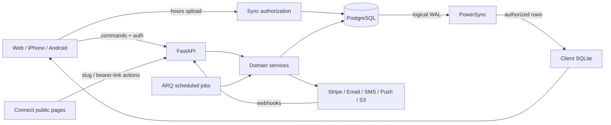

# Backend review — 7 October 2026

The backend has a substantial, coherent implementation: one PostgreSQL source of truth, shared service logic for every client, tenant-scoped queries, explicit roles, and an append-only financial ledger with database enforcement. The largest remaining risks are recovery across database/provider boundaries, historical financial snapshots, production messaging, and concurrent state transitions. Passing the existing tests does not establish those properties.

This review made narrow, reproduced corrections. It did not redesign payment settlement, change accounting policy, provision production services, or migrate existing customer data. The recommendations below distinguish source-confirmed behavior from scenarios that still need concurrency or real-provider reproduction.

Follow-up: the [principles review](principles.md) adds database RLS/least-privilege, pagination, concurrency and operational-contract findings. The [implementation plan](../../executions/backend-hardening/plan.md) and [task queue](../../executions/backend-hardening/tasks.json) cover every finding; execution is underway with a low-effort subagent and primary-agent review.

## Scope and evidence

The stable baseline is commit `9372caf`, plus the changes described under **Corrections made**. The initial inventory contains **277 backend files**: **116 application modules**, **102 test/support files**, **20 migration files**, **35 script/fixture assets**, and four project configuration files. Three regression files were added. The accompanying [file audit](files.csv) contains **301 entries**: **287** from the verified snapshot, including the Python pin and backend-related root/infra/CI configuration, plus **14** newly added concurrent feature files inspected separately. Each entry identifies its snapshot, purpose, symbols or tests, review method, and content hash. The 14 source-only entries are explicitly excluded from the runtime verification claim.

All application implementation modules were traced through their API/schema/model/service boundaries. Migrations, scripts, provider adapters, sync configuration, and job scheduling were reviewed. Every test file was inventoried by its contracts; relevant failure paths and regression bodies were inspected in detail, and the complete default test suite was executed. This is not a claim that every existing assertion was independently rewritten or that every provider was exercised live. PNG seed assets were inventoried by format, dimensions, and use, not visually audited as backend code. Local secrets, generated caches, virtual environments, and downloaded dependencies are outside the source inventory.

Other work began changing the shared checkout during this review, including Connect order/account features and backend models. To avoid overwriting that work or drawing conclusions from partially edited files, final backend checks use an isolated worktree and a **separate freshly migrated and seeded PostgreSQL database**. The hashes identify exactly what was reviewed and verified. Concurrent feature work needs its own integration gate after it settles; this report is not certification of that moving changeset.

Related product reviews: [web/Connect surfaces](../product/web-and-connect.md), [native mobile surfaces](../product/mobile.md).

## How requests and data move

- **Provider web and native apps share one backend contract.** Most reads come from a PowerSync SQLite replica. `frontend/packages/app-core` owns shared queries/actions; `api-client` supplies authenticated transport and generated types. Device-specific differences are storage, native capabilities, and presentation.
- **Connect uses public HTTP contexts and commands.** Slugs expose published business/catalog availability; unguessable links expose a particular invoice, estimate, receipt, form, contract, review, or booking. These links are bearer credentials even though there is no signed-in client account in the audited baseline.
- **Only ordinary hours are offline writable.** `/sync/upload` accepts `hours`; exception/time-off rows require commands. Clients, bookings, catalog, money, documents, and messaging use server commands. A queued hours transaction remains pending if the server rejects it.
- **API → service → model is the dominant structure.** Pydantic schemas constrain inputs/outputs; services load scoped rows, enforce roles, and commit. `run_command` adds audit and replay records to a transaction for most consequential writes. Several simpler CRUD services commit directly.
- **The ledger is authoritative for money.** Accounts identify tenant, owner, category, code, and currency. Journal legs sum to zero; PostgreSQL checks balance at transaction end and refuses entry updates/deletes. Cached account balances and projections are maintained by posting rules. Invoice/order paid state, entitlement balances, tax payable, and staff earnings are derived from those records.
- **External effects are not transactionally coupled to PostgreSQL.** Some provider calls happen before commit, some notifications after commit, and there is no durable outbox/inbox processor. That is the central reliability gap across all client apps.

## System inventory

Unless specified otherwise, each concept has matching `api/<concept>.py`, `schemas/<concept>.py`, and `services/<concept>.py` under `backend/src/clientbridge`. The CSV lists every individual file and symbol; this table explains their combined behavior.

| System | What currently exists and how it is built | Main remaining concerns |
|---|---|---|
| Application/bootstrap | `main.py` mounts authenticated, public, webhook, and sync routers; CORS and typed error handlers surround the app; `/health` is a static liveness response. | Production validation, readiness, request correlation, shutdown and dependency health. |
| Core/authentication | `core/security`, `services/auth`, `models/auth`: Argon2 passwords, HS256 API access tokens, hashed refresh sessions with family reuse revocation, single-use reset/verify tokens, Google verification through a provider adapter. | Token-consumption races, account identity normalization, incomplete password/email constraints, distributed abuse controls. |
| Tenant and role resolution | `core/deps` resolves active staff membership and an optional `X-Business-Id`; `core/scoping` provides scoped SELECT/UPDATE/DELETE; services assert roles. | Composite relationship integrity, closed-business enforcement, multiple-business client transport, explicit sync/HTTP permission matrix. |
| Commands/audits | `core/command`, `models/platform`: callback inside a transaction, audit events, saved response keyed by business/action/key. | No atomic command claim, request fingerprint, or complete actor/resource binding; external effects can precede a losing commit. |
| Sync | `sync/auth`, `sync/upload`, two PowerSync YAML files, generated schema: 35 synced tables, shared/team/self/manager projections, local-only device preferences. | Permanent queue rejection recovery, production signing keys, replica permission transitions and field minimization. |
| Business/onboarding | Creates business + owner membership atomically; profile, locale/timezone, tax registration, brand, booking policy, Stripe KYC/payout state. | Invalid timezone acceptance, closed-business lifecycle, production adapter readiness. |
| Staff | Invite/resend/revoke/accept, roles and removal, team listing, pay settings and discount-approval PIN. Invites are hashed; removed staff lose refresh sessions and principal access. | Concurrent invite/role transitions, device logout cleanup, identity rules. Push membership was corrected here. |
| Clients | Contact/custom fields, tags, preferred channel, consent creation, archive/restore, bulk tagging/archive, guarded merge with thread consolidation. | Merge references/Stripe customer identity, merge races, archive versus deletion semantics. |
| Subjects and notes | Client pets/other subjects with validated attributes and soft deletion; notes support editing, pinning, deletion and author/manager permissions. | Subject relationship validation was corrected for booking/recurrence/class inputs; polymorphic parent references still need systematic coverage. |
| Catalog | Service/class/product/package/subscription/gift items; price, duration, buffers, deposits, online flags, tax class, stock metadata, package coverage and membership benefits. | Subscription price versioning, benefits enforcement, currency policy, published product change history. |
| Scheduling | Hours, date overrides, time off/closures, resource checks, staff advisory locks, PostgreSQL overlap exclusions, appointments, class roster/waitlist/promotion/check-in, moves and completion/no-show. | Shared-class mutation semantics, datetime/timezone validation, public availability consistency, deposit cancellation/settlement races. |
| Recurrence | Finite expansion with daily/weekly/monthly modes, same-date or nth-weekday monthly repetition, DST wall-clock preservation, exceptions, conflict reporting, series change/cancel. | Hard 60-occurrence ceiling, input bounds, shared-slot edits, atomicity across related bookings. |
| Public booking/manage | Published services/staff/add-ons, availability by day/time, lead/horizon and cancellation/reschedule policies, client matching, pet/note creation, deposit PaymentIntent and manage token. | Booking a time absent from availability under unconfigured hours, link lifecycle, canceled/late deposits. Shared-class public moves are now refused. |
| Billing and lines | Draft invoice/estimate composers, discounts, tax/line snapshots, optional estimate add-ons, numbering, sending, accept/decline/convert, invoice voiding and deposit application. | Historical tax components are recomputed from current settings; concurrent send/edit/numbering transitions; booking-to-client ownership within a tenant. |
| POS orders | Open/held sales, line pricing, staff assignment, cash/card/Terminal checkout, manager PIN discount approval, tips, itemized receipts, online pickup progression. | Locking/rechecks across pay/edit/void, immutable sale basis, pending card reservation/recovery. |
| Payments | Manual recorded payments, interactive/off-session card intents, PAD setup, saved methods/default/detach, partial refunds/credit notes, Interac requests, fees, disputes and payouts. | Pending/failed refund lifecycle, saved-method mandate eligibility, provider reconciliation and transactional recovery. |
| Entitlements | Cash/card package and gift purchases; grant on settlement; consume/redeem; expiry/breakage; subscription creation/cancel and recurring invoice events. | Catalog mutation after purchase, gift redemption sale/tax association, package coverage and membership benefits, cancellation failures. |
| Inventory | Stock movement on sale settlement and full refund; unique movement identities avoid duplicates; restock/correction records with costs. | Online stock is checked without reservation; paid concurrent orders can exceed available stock. POS overselling is explicitly allowed by current tests. |
| Earnings | Percentage/fixed/hourly booking earnings and retail commissions, tip allocations, pending/approved/paid stages, bulk transitions and refund reversals. | Real payout versus recorded-payment semantics, approved earning correction policy, default currency assumptions. |
| Reports/dashboard | Ledger-based income/tax, sales by item, T4A/payees, payouts, monthly summaries, CSVs/ZIPs, Today dashboard. `DashboardService` lives in `services/reports.py`. | Mixed-currency totals, historical jurisdiction snapshots, time-boundary consistency, CSV formula escaping, query costs. |
| Remittances | Filing periods, GST/HST/provincial families, input credits, overlap protection, recorded filing/remittance journals. | This records bookkeeping; it does not file with or pay a tax authority. Zero/refund returns and filing rules need domain review. |
| Messaging | Inbox threads/read state, SMS/email send records, broadcasts with audience/consent filtering, scheduled fanout, inbound SMS and dedupe. | Twilio integration and tenant routing, delivery retries, >500 audiences, consent consistency and durable send claims. |
| Notifications/devices | Central copy builders, receipts/invites/reminders/reviews/document links; per-channel adapters; device registration and 60-day pruning. | Outbox, accepted-versus-delivered status, Expo tickets/receipts. Removed-member push and registration heartbeat were corrected. |
| Consents | Append-only changes, marketing eligibility, expiring implied consent, STOP/START, signed preferences/unsubscribe and export. | Transport STOP can be superseded by later general consent; class messaging bypasses the normal text-stop guard. |
| Forms | Form/question editor, stable answer keys, send/resend, draft/open/submitted response state, required-answer check, presigned attachments, new-client intake job. | Typed answers, required checkbox/signature semantics, immutable form version and upload finalization. |
| Contracts | Publish versioned text, send/resend requests, public typed/drawn signing or decline, snapshot signed body/version and signer details. | Locking for one-time signing; what happens when text changes after a client views the request; no signed-PDF pipeline. |
| Reviews | Request dedupe, opened/submitted state, rating-based hold, owner response/hide/publish, Google link sharing and automatic request job. | Delivery guarantees, bounded lookback after downtime, public link expiry policy. |
| Files/media | Server-generated keys, presigned PUT/GET, public-only logos/item images, brand image association, public intake uploads. | No verified upload completion, object-size enforcement, malware/content checking, private-download lifecycle or orphan cleanup. |
| Jobs | `tasks/worker.py` wires nine cron jobs: reminders, unpaid-booking reap, broadcasts, overdue invoices, entitlement expiry, device prune, ledger reconciliation against Stripe balances, review requests, intake forms. | Durable per-item work claims, retry policy, backlog catch-up, bounded batches, poison-record handling and alerts. |
| Integrations | Stripe async gateway, Google verification, Postmark/Expo HTTP, optional synchronous Twilio SDK, boto3 presigning. Recording fakes isolate tests. | Incomplete real-provider coverage, blocking SMS SDK call, no-op production fallback, error receipt handling. |
| Migrations/tooling | One squashed baseline plus 17 increments; enums/checks/indexes/FKs/exclusion constraints and ledger triggers; OpenAPI/sync codegen, structure lint, demo seed and browser fixtures. | Destructive reseed safety, migration rollback/restore drills, release compatibility and reproducible infrastructure versions. |

### Persistence and migration details

`models/business.py` owns businesses/users/staff; `clients.py` owns clients/subjects/notes; `catalog.py` owns items/stock/subscriptions/packages/gift cards; `scheduling.py` owns availability/resources/recurrences/slots/bookings/add-ons; `billing.py` owns estimates/invoices/orders/lines; `payments.py` owns payment attempts and saved methods; `ledger.py` owns accounts/entries; `messaging.py`, `documents.py`, and `reviews.py` own engagement data; `platform.py` owns commands/audits/webhooks/devices/files; `auth.py` owns sessions and one-use tokens. `base.py` supplies reusable column mixins and enum checks; `models/__init__.py` registers every table for Alembic.

The baseline installs `btree_gist`, prohibits overlapping live staff/resource slots, and installs deferred balance and append-only ledger triggers. The increments cover pre-squash alignment, check-in, staff names, pickup timestamps, plan/stock fields, invoice/estimate additions, credit notes/disputes, sale tips/discounts, tax returns, client consent, account settings, messaging/documents, time-off windows, monthly recurrence, class waitlists/resources, booking policy/manage links, and removal of unused columns. A fresh upgrade to head and `alembic check` both passed in this review. Downgrades are not guaranteed lossless: several deliberately rewrite or discard newer states before dropping columns.

Foreign keys generally verify only a referenced ID, not `(business_id, id)`. The database therefore accepts a valid row from the wrong tenant unless the service rejects it. The corrected inputs below close reproduced entry paths; a planned composite-FK migration would provide a wider backstop after auditing and cleaning existing relationships.

## Corrections made

These changes alter eight application files. They introduce no schema migration and leave the generated API and sync shapes unchanged.

| Correction | Reproduced behavior → corrected behavior | Retained coverage |
|---|---|---|
| **Sync ownership and identity** | A staff member could reassign their own hours to another member; an owner could reference another tenant's staff; PATCH could replace the primary key supplied by the operation. Incoming ownership is now validated, `op.id` consistently wins, existing rows are locked, and an upsert conflict rechecks tenant/staff/command-only ownership. | `test_sync_upload.py`: PUT/PATCH reassignment, foreign staff, identity preservation; two real two-connection PostgreSQL races prove protected rows cannot be overwritten between lookup and insert. |
| **Billing booking references** | Invoice, estimate and order lines accepted a booking from another business, which downstream financial helpers could dereference. Shared line validation now requires a live booking in the current tenant. | `test_billing_references.py`: create and edit paths for all three document types. Existing suites retain valid visit/deposit/commission flows. |
| **Booking subject/resource references** | Appointments and recurrences accepted foreign, wrong-client or deleted pets; recurrence creation accepted foreign/inactive resources. Subject checks now include tenant/client/deletion; recurrence validates the resource before expanding. Class subject checks use the same helper. | `test_bookings_references.py`: six subject cases and foreign/inactive recurrence resources, plus existing scheduling/class suites. |
| **Public class rescheduling** | A single attendee's manage token moved the shared class slot and therefore everyone else's booking. Public class moves now return a clear 409 and `can_move=false`; individual cancellation remains available under policy. | `test_public_manage.py`: two attendees sharing one slot, refused move, unchanged session and allowed cancel capability. A future attendee-transfer feature needs a separate design. |
| **Delivery HTTP failures** | Postmark and Expo treated provider HTTP 4xx/5xx responses as successful returns. Both now raise HTTP errors into existing failure/logging paths. | `test_notifications_delivery.py`: actual adapters with an HTTP transport fake, 200/422/500 responses and request payload/header checks. This does not yet implement retries or Expo ticket handling. |
| **Push membership and heartbeat** | Removed staff devices remained payment/dispute recipients; repeated unchanged registration did not refresh `updated_at`, allowing active devices to be pruned after 60 days. Push recipients now require active membership in that business; registration refreshes the heartbeat. | `test_notifications.py`: removed member remains active in a different business yet receives no push; re-registration survives pruning. |
| **Nova Scotia current HST** | Current calculations used 15%. The province table and golden/API cases now use **14%**, effective April 1, 2025. No historical rows were rewritten. | `test_tax.py`, `test_billing_invoices.py`. The [CRA rate table](https://www.canada.ca/en/revenue-agency/services/tax/businesses/topics/gst-hst-businesses/charge-collect-which-rate.html) and [transition notice](https://www.canada.ca/en/revenue-agency/services/forms-publications/publications/notice342/nova-scotia-hst-rate-decrease-questions-answers-general-transitional-rules-personal-property-services.html) establish the current rate; historical effective-date snapshots remain a separate issue below. |
| **Fresh-seed test reliability** | Five existing inventory/flow tests assumed the seeded shampoo had no stock/history, although the current seed creates both. Stock-history tests now create their own product; the full sale/refund flow asserts exact changes from the opening stock. | `test_catalog_products.py`, `test_flows_sales.py`; fixed after reproducing failures against a newly created database. Production inventory behavior was not changed. |

The first regression run produced **27 failures and two successful-delivery controls** before the application fixes. The retained additions increase the default suite by **32 cases**, including two concurrency cases and an ignored-ID-only PATCH no-op. Existing golden tax expectations were updated, and five existing fixture assumptions were corrected.

## Remaining findings and recommended solutions

Priority here is an engineering recommendation, not a claim that these features are currently deployed. **P0** means resolve before relying on the affected feature with real customer money/data. **P1** means important correctness or hardening work. **P2** means bounded polish, scale or operational improvements. Unless marked reproduced above, these findings are based on traced source/control flow; the proposed acceptance tests still need to be implemented.

### P0 — money, delivery and production boundaries

**B01 — Refunds can be booked as complete while the provider says pending or failed.** `PaymentService.refund_payment` returns the provider's status but stores `Payment.status="succeeded"` and immediately applies financial reversals. `refund_deposit` follows the same assumption. `_reconcile_refund` ignores failed/canceled events and treats other unseen refund statuses as success; once a row exists it cannot evolve through those transitions. Stripe explicitly supports [pending and failed refunds](https://docs.stripe.com/refunds). All clients can therefore show a completed refund, restored stock or restored entitlement before the refund actually settles. **Recommendation:** persist the provider refund lifecycle, reserve refundable room for pending refunds, distinguish requested credit from settled cash reversal, and reconcile success/failure/cancellation idempotently, including corrective ledger journals. Test pending→success, pending→failure, success→failure, duplicate/out-of-order events, partial refunds and cancellation. Deferred because it changes accounting transitions, customer messages and recovery, not just a status string.

**B02 — Commands and external side effects lack durable recovery.** `core/command.run_command` checks for a previous response, runs the callback, then saves the response. Simultaneous requests can both pass the check; a unique-key conflict can occur after a provider operation. Stripe idempotency helps some methods, but locally generated payment IDs or differing provider keys can defeat replay across a rolled-back attempt. Validation before replay also makes some otherwise identical retries fail once the entity's state changes. **Recommendation:** create/claim a command atomically using a stable business/action/resource/request identity, store a payload fingerprint, reauthorize replays, serialize conflicting financial transitions, and persist external-effect attempts with reconciliation. Test simultaneous identical and conflicting requests using independent connections, plus provider success followed by DB failure/process death. Deferred because a correct protocol spans every money path and crash recovery.

**B03 — Outbound messages have no durable delivery guarantee.** `Notifier._safe` logs errors and returns; jobs can then mark rows reminded/notified even though nothing was delivered. Some send paths call a provider before the database commits; others commit first and can crash before notification. The HTTP-error fix makes rejection visible, but does not recover it. **Recommendation:** record an outbox event in the business transaction; a worker claims deliveries, stores per-channel attempts/provider IDs, retries transient failures with backoff, and exposes terminal failures. Dedupe on event/recipient/channel. Distinguish queued, provider-accepted and delivered. Test failure on each side of commit, worker restart mid-batch and retries without duplicate logical sends. This needs a persistent model and operational workflow.

**B04 — The Twilio path is not a complete production SMS integration.** `integrations/twilio.py` imports a package absent from both `pyproject.toml` and the locked graph; its synchronous call would also block the async loop. `/webhooks/sms` compares `X-Twilio-Signature` to a static secret rather than verifying Twilio's signed request. It discards the destination number; `process_inbound_sms` takes the first client matching `From` across businesses. A shared client phone can route a reply or STOP to the wrong tenant. **Recommendation:** decide number/Messaging Service ownership per business, resolve tenant from the authenticated destination/account, use async transport or an appropriate worker, install the actual dependency, and validate the original request URL/body using [Twilio's signature protocol](https://www.twilio.com/docs/usage/security). Test two tenants with the same client phone, different destinations, replay and tampering. Deferred because tenant routing cannot be safely invented from the current global sender configuration.

**B05 — Financial history consults mutable present-day configuration.** `tax.tax_breakdown`, public document rendering and notification itemization recompute tax from current business province/registration/rates. `ledger._order_sale` recalculates line tax during settlement; package settlement consults current catalog price. `SubscriptionService` caches one `stripe_price_id` on an editable item, while recurring local invoices are built from current item values. Editing tax settings or a price between creation and settlement can make provider charge, receipt, ledger, and reports disagree. **Recommendation:** snapshot currency, taxable basis, discounts, jurisdiction, effective rate, component amounts and product/plan version at commitment; settle from those immutable facts and the provider invoice, not today's catalog. Version Stripe prices. Add change-after-issue, change-before-webhook, backdated-document and recurring-price tests. Do not “fix” old rows by recalculating them with today's rates; existing discrepancies require an explicit reconciliation plan.

**B06 — Webhook processing needs an inbox and reconciliation state machine.** `process_stripe_event` does not retain a durable pending record outside the same transaction as financial processing; broad commit-time `IntegrityError` handling can acknowledge errors as if they were duplicates. Some ordering is explicitly handled—an app-owned unknown PaymentIntent is retried—but an unknown subscription's recurring invoice can be ignored. Settlement locates a payment by provider reference without checking all of connected account, amount and currency against the stored attempt. A missing balance transaction can become a permanently zero fee posting. **Recommendation:** persist verified events with provider/account/event uniqueness, claim and process them with explicit retry/dead-letter reasons, validate monetary identity, fetch canonical provider objects where needed, and reconcile pending/missing payments, fees, subscriptions and payouts. Test reorderings, duplicates, database failures and unavailable balance transactions. This extends existing protections rather than replacing the ledger.

**B07 — Runtime production configuration does not fail closed comprehensively.** `Settings` defaults to `ENV=dev`; dev permits an unauthenticated sync token for the demo user. Outside dev it rejects the exact development JWT string but accepts an empty/weak alternative, and does not require durable RS256 keys or configured delivery channels. Missing RS256 PEM generates a process-local key with a stable key ID, unsuitable for several workers/restarts. Missing email/SMS/push credentials select no-op success senders. **Recommendation:** explicit production environment and strong secrets, durable signing key lifecycle/JWKS, capability-specific readiness checks, and visible “not configured” errors for enabled channels. Validate startup for the deployment's required capabilities; test multiple workers/restarts and absent credentials. Deferred to a concrete production deployment/configuration contract, not ad hoc credential guesses.

### P1 — authorization, scheduling and client contracts

**B08 — Refresh and one-use token consumption are read-then-write races.** `services/auth` loads a refresh session/reset or verification token and then changes it without locking or atomic consumption. Sequential reuse tests pass, but parallel requests may both observe an unused token. **Recommendation:** row locks or conditional UPDATE…RETURNING with deliberate refresh-family semantics; persist reuse revocation even when returning an auth error. Add genuine concurrent refresh/reset/verify/invite acceptance tests. Also make production clients revoke refresh sessions at logout; current client sign-out clears local tokens/replica without calling `/auth/logout`.

**B09 — Identity and abuse boundaries are incomplete.** Auth inputs are largely unbounded strings, email matching is case-sensitive, and password/email policy is not shared across registration/reset/invite paths. Google lookup links by verified email and needs an explicit rule for an already-bound but different provider subject. Login/PIN/public limits are per process, forwarded IP is trusted directly, and failed-login buckets can grow with arbitrary identities. **Recommendation:** canonical email identity plus a collision migration, bounded password/email inputs, explicit provider-subject uniqueness/linking, Redis-backed limits, trusted proxy parsing, and expiration/bounds for buckets. Test identity collisions and multi-instance throttling. Policies and existing-account migration need deliberate choices.

**B10 — Cross-tenant integrity still relies on each entry point.** The reproduced booking/line/hours gaps are fixed, but polymorphic references, direct `db.get` traversals and single-column FKs remain. Same-tenant references also need business ownership rules: a line linked to a visit should not silently consume another client's deposit. Closed businesses are not consistently rejected by principal/public business lookup. **Recommendation:** build a relationship matrix; enforce tenant, parent/client and active/deleted semantics at entry points; backstop concrete relationships with composite FKs after a data audit. Define closed-business access explicitly. Test foreign/deleted/same-tenant-wrong-client references for every mutation. Avoid one global “active-only” rule that would make historical documents unreadable.

**B11 — Public availability and booking creation can disagree.** `open_slots` returns no times for a day without configured hours, while the common scheduling helper treats no hours as unrestricted. A direct public booking request can therefore target a time that the public availability UI would never offer. **Recommendation:** make public creation use the same eligibility predicate as availability, while preserving any intended staff override. Add unavailable-day/direct-POST tests, hidden staff, class capacity and lead/horizon cases.

**B12 — Booking cancellation and pending deposits can diverge.** Reaping/canceling an unpaid online booking does not reliably cancel or reconcile its provider intent. A late success can collect money for a canceled visit; a failed deposit can escape the pending-only reaper. `collect_deposit` checks eligibility before a serialized reservation of the payment attempt. **Recommendation:** a deposit attempt lifecycle tied to booking state; cancel/reconcile the provider attempt, define late-success refund policy, and serialize collection/cancellation/settlement. Test two devices collecting simultaneously, expiry during payment confirmation, failure then retry and canceled-then-success webhook sequences.

**B13 — Shared class and recurrence changes need explicit semantics.** The public attendee move is blocked now. Staff paths can still operate on shared slots through an individual booking/series; moving a shared slot's staff or time must update and notify all affected attendees consistently. **Recommendation:** distinguish session-level changes from attendee transfer, lock the session, and update derived booking staff references together. Test series changes involving shared sessions and mixed attendees. A transfer should create/join an eligible target session, not mutate the original shared slot.

**B14 — Datetime and range contracts need normalization.** Business timezone is accepted as a string and later passed to `ZoneInfo`; invalid values can break scheduling/reports/jobs. Several booking inputs accept naive datetimes that can fail against aware comparisons. Availability computes some day ends by adding 24 hours to UTC midnight, which is not always the next local midnight. Reports mix a `time.max` upper bound with `<` and `<=`, producing a last-microsecond edge. Recurrence bounds also permit problematic zero/negative counts and silently cap expansion at 60. **Recommendation:** validate IANA zones and aware instants, construct both bounds in local civil time, consistently use half-open ranges, and expose/validate recurrence limits. Add invalid-zone, DST spring/fall, ambiguous/nonexistent local time and exact-boundary tests. These can be separate small changes with clear contracts.

**B15 — Multi-business sessions are not fully connected to the apps.** The backend requires `X-Business-Id` when a user belongs to more than one business. The inspected shared session transport has no business-selection/header option. A second membership can therefore make previously working `/v1` commands fail, even though sync has data for memberships. **Recommendation:** selected-business state in the shared session, a business chooser in web/native, query scoping on the selected business, and consistent cache/replica behavior during switching. Test one user in two businesses with different roles and overlapping local IDs in view state.

**B16 — Permanent offline upload failures block the queue.** The connector retries all non-2xx uploads indefinitely and only completes the queued transaction after success. A revoked permission or invalid stale row can prevent later valid hours changes from uploading. `_coerce` also accepts unknown fields and can raise raw parsing errors for malformed date/time values. **Recommendation:** a versioned validated hours payload plus a per-transaction rejection/reconciliation workflow that lets the user correct or discard a permanent failure without silently losing edits. Retry transport/5xx separately from permanent 4xx. Test offline changes, membership removal, invalid legacy data and reconnect on both SQLite implementations.

**B17 — Sync fields and HTTP permissions need one reviewed matrix.** Shared replication includes full rows for some models, including gift-card codes and provider-related references. Staff restrictions on money screens do not by themselves restrict every synced field or desk-sale HTTP response. **Recommendation:** classify each field by role and purpose, choose explicit projections for sensitive tables, and assert parity between SQL buckets and service permissions. This is a policy review; presence of a provider reference alone is not proof of an exploitable secret. Add real PowerSync tests for role downgrade/removal, tenant switching, field absence and local data removal.

**B18 — Saved payment methods lack a complete eligibility/lifecycle contract.** Explicit saved-method lookup does not consistently require active status and an active bank mandate. Attachment is treated as sufficient for bank mandate activation. Detach calls the provider before deleting a row that an existing subscription can still reference; a foreign-key failure can leave local/provider state inconsistent. Auto-update only refreshes some card metadata. **Recommendation:** central chargeability validation; consume setup/mandate/detach/update events; retire methods instead of deleting historical references; require subscription replacement/cancellation before detaching an in-use method. Test revoked/pending mandate, inactive method, expiry update and method used by a subscription.

**B19 — Online inventory is not reserved.** Shop and add-on code checks stock before payment, while inventory moves when settlement arrives. Multiple independently valid checkouts can consume the same final unit. **Recommendation:** reserve stock atomically per payment attempt, expire/cancel holds, consume on settlement and reconcile late success, while retaining the intentional POS oversell policy. Test two concurrent checkouts for one unit, abandoned checkout and late webhook. This needs a stock reservation lifecycle rather than changing a comparison.

**B20 — Consent guards differ by send path.** Normal client notification/message paths honor `texts_stopped`; class fanout does not. STOP is inferred from the latest general consent record, so a later preference grant can override a transport-level STOP. **Recommendation:** separate provider/transport suppression from marketing permission and route all outbound SMS through one eligibility check; define how START re-enables it. Report only actual accepted sends, not attempted recipients. Test STOP→preferences→class message and STOP/START on a shared client phone after tenant routing is fixed.

**B21 — Client merge is not yet a complete identity migration.** The merge protects balances/saved methods, but file parent references and polymorphic form/signature parents are not all moved; a source Stripe customer reference can be orphaned. Concurrent writes can attach new data while a merge proceeds. **Recommendation:** an explicit merge plan with a locked source/target, dependency inventory, provider customer policy and post-merge integrity check; preserve redirects/audit history for retired IDs. Test each related table, active subscription conflicts, provider identity and a concurrent booking/message. Deferred because destructive identity consolidation needs a product/data policy.

### P1/P2 — documents, bookkeeping and operations

**B22 — Forms and contracts need immutable submission contracts.** Form submission checks only required non-empty values, not the declared field's full type/options/validation, and `require_signature` is not a completed enforcement path. Editing questions can change the meaning of old answers. Contract signing snapshots text at signing, but lacks a version precondition tied to what the client saw and a lock preventing concurrent sign/decline. **Recommendation:** immutable published form/contract versions, typed answer validation including owned attachment IDs, required agreement/signature semantics, and atomic terminal transitions. Test edit-between-view-and-submit, double submission/signing and cross-response file references.

**B23 — File records do not prove an upload exists or is safe to serve.** Size/content type are client assertions; a presigned PUT is issued before object verification, without a finalize/HEAD step or cleanup lifecycle. Private downloads and signed-document PDFs are not complete product paths in the audited backend. **Recommendation:** pending→verified upload state, object-store enforcement/verification, purpose-based content policy, scoped private download, retention/orphan cleanup, then a separate immutable document rendering pipeline. Test missing, oversized, replaced, foreign and expired objects. Storage policy and document retention need decisions before implementation.

**B24 — Entitlement sales and usage are not fully joined to service delivery.** Catalog coverage and membership benefit fields exist, but the generic consume/redeem commands do not complete a booking/sale benefit application contract. Gift redemption posts liability to revenue without an associated taxed sale; package settlement can consult changed item values. **Recommendation:** explicit entitlement application to a particular visit/sale, eligibility and double-use protection, immutable purchase basis, and accounting rules for tax timing, breakage and reversals. Validate with the intended business/accounting policy. Tests should follow purchase→eligible usage→refund/expiry, not just decrement a balance.

**B25 — Currency and filing scope need a product decision.** Items/orders allow non-CAD currency, while invoices/deposits/gifts and some earnings/report totals assume CAD or aggregate without a currency dimension. Tax remittance records reject zero tax owed or credits above collected, and generic filing due-date logic does not encode every business situation. **Recommendation:** either enforce supported CAD-only flows end to end or propagate currency through every document, ledger/report and provider comparison. Separately, support nil/refund tax returns as required by the chosen bookkeeping scope and validate due-date/payee rules with a qualified domain reviewer. Do not portray “record filed/paid” actions as actual government filing, bank transfer or payroll execution.

**B26 — Interac is a matching stub with recovery/accounting gaps.** The webhook is a shared-secret reference/amount endpoint, not a finished financial-provider integration. Dedupe is reference-based; unmatched/underpaid events can be treated as processed before a future match exists. Overpayments book only the requested amount; a test explicitly expects that behavior, leaving the surplus unrepresented. **Recommendation:** choose the provider, persist immutable transfer events separately from match decisions, support retryable/unmatched queues, model fees/currency/partial/overpayment and assign excess credit or a return. Test delayed invoice creation, duplicate transfer IDs, repeated reference codes, short and excess payments. Provider selection and excess-funds policy make an automatic patch inappropriate.

**B27 — Scheduled work can miss or duplicate recipients.** Broadcast audience selection caps at 500 without a complete paged continuation; status/send progress is not durably claimed per recipient. Intake/review jobs use bounded lookback windows, so downtime can skip records. Job loops lack comprehensive batching/checkpoints and one record can fail a run. **Recommendation:** durable work rows/cursors, claim-and-retry processing with bounded batches, per-recipient delivery state, backlog metrics and poison-record isolation. Test >500 recipients, two workers, outage beyond lookback and a crash halfway through fanout.

**B28 — Expo acceptance is not delivery.** The corrected adapter now rejects HTTP errors, but does not parse individual push ticket errors, collect receipts, retire `DeviceNotRegistered` tokens or split large sends. [Expo's protocol](https://docs.expo.dev/push-notifications/sending-notifications/) requires ticket/receipt handling and limits send batches. **Recommendation:** preserve token→ticket→receipt mapping in the delivery system, chunk requests, retry transient errors and deactivate invalid tokens. Test an HTTP-200 mixed success/error response and partial batch delivery. A batch-level exception alone would risk resending already accepted notifications.

**B29 — Operational readiness is not established by the repository.** Local Compose is a development stack, with published database/Redis/object-store ports, development credentials and several `latest` images. No reviewed production infrastructure, restore exercise, readiness checks, structured correlation/metrics or alert routing establishes operational resilience. Ledger reconciliation records drift but is not a full repair/alert pipeline. **Recommendation:** production deployment/runbook with managed secrets, pinned images, migrations and backward-compatible rollout, DB/WAL/object backup and restore drills, connection/load budgets, health/readiness, monitoring of money/delivery/sync lag and an incident workflow. This is an environment/infrastructure workstream; local defaults are not proof of an exposed production service.

**B30 — Test/tooling confidence can be made more representative.** The default suite uses real PostgreSQL but mostly one savepoint-backed session per test, hiding independent-connection races. Provider fakes default to immediate success; contract tests check shapes, not lifecycle. Browser/native coverage exists from earlier reviews but is not fully represented by a web-PowerSync/native CI gate. `seed_demo.main` truncates all tables while Makefile help calls the seed idempotent; it has no environment guard. CI uses `uv sync` instead of an explicitly frozen install. **Recommendation:** retained adversarial concurrency/provider-failure matrix, a clean DB fixture path, CI migration drift, selected real-provider test-mode flows, web/native sync smoke coverage, guarded destructive developer scripts, pinned/frozen builds and dependency/security scanning. Five fresh-seed test assumptions were corrected in this pass; production load and restore testing remain unperformed.

**B31 — Smaller output/query issues deserve a bounded follow-up.** CSV output includes user-editable names without consistent spreadsheet-formula escaping; not every exported string uses the consent export's guard. Availability and some reports do repeated per-day/per-staff/per-row queries; no representative large-tenant budget was measured. **Recommendation:** one CSV cell escaping helper applied to every untrusted string, contract tests using `=`, `+`, `-`, `@` prefixes, and measured query/latency budgets before optimizing. Also surface backend structured error messages/codes in the shared client transport instead of reducing all failures to method/path/status; this would make the existing 409/422 guidance useful on web and phones.

## Recommended order of work

1. **Stabilize money and recovery:** B01/B02/B05/B06, then deposit/payment state transitions in B12/B18. Establish immutable sale facts, serialized attempts and provider reconciliation before adding more charge/refund surfaces.
2. **Make communication real and recoverable:** B03/B04/B20/B27/B28. Tenant routing, suppression and outbox records should be designed together.
3. **Close production/auth/sync contracts:** B07–B10 and B14–B17, with a shared web/native business-selection and permanent-upload-error design.
4. **Complete product-specific lifecycles:** class transfers, stock reservations, client merges, forms/signing, private files/PDFs and entitlement/tax scope.
5. **Prove operation under failure:** frozen builds, multi-connection CI cases, restart/replay tests, real provider test mode, large-tenant performance and backup restore. Keep the existing ledger/database protections throughout.

## Validation record

| Check | Result and scope |
|---|---|
| Complete default backend suite | **1,222 passed**, 20 deselected; **95.18%** branch-inclusive coverage, above the 90% gate. Includes the retained regression and independent-connection concurrency cases. |
| Stripe adapter contract tier | **17 passed** against local stripe-mock. These verify adapter contracts, not live Stripe settlement or failure recovery. |
| Backend lint, strict typing and structure | Ruff and structure checks passed; mypy reported no issues in **227 source files**. |
| Python formatting | **246 files** already formatted. |
| Clean database migrations | Fresh `alembic upgrade head` and `alembic check` passed; no metadata drift in the audited migration chain. |
| Generated contracts | OpenAPI TypeScript regeneration and sync schema regeneration produced no diff; **35 synced tables**. The audit fixes introduce no API shape or migration change. |
| Shared checkout preservation | The corrected functions were compared with the verified snapshot and remain present alongside the concurrent feature work. `git diff --check` passed. |
| Whole shared-checkout gate | The attempted `make check` stopped on line-length violations in concurrently edited `models/billing.py`. No full monorepo success is claimed for the moving checkout. The isolated backend gate above passed independently. |

Checks used `.scratchpad/backend-review/verified` and the separate database `clientbridge_backend_review_20261007`. Logs and reproduction output remain in `.scratchpad/backend-review/`, including `final-backend.log`, `contract.log`, `migration-drift.log`, and `generated-drift.log`. The fresh seed's existing stock/history assumptions caused five failures on the first full run; their fixture corrections are described above. The final suite passed after those corrections.

The review did not run live customer charges/refunds, send real customer messages, or change the shared demo database's schema/seed. The isolated seed disabled object-store uploads and used no Stripe credentials. Existing work in the shared checkout was preserved.

## Concurrent feature work inspected separately

The following additions appeared while this review was underway. Their source and migration/test contracts were inspected, and the 14 new files are included as **concurrent source-only** rows in the CSV. They are outside the frozen test run and may continue changing. Existing files modified to integrate these features retain their verified baseline hashes in the CSV; this table records the additional source context without presenting it as tested behavior.

| Added area | Files and current design | Integration checks still needed |
|---|---|---|
| Returning clients | `api/returning.py`, `schemas/returning.py`, `models/returning.py`, `services/returning.py`: email/SMS codes, tenant-bound hashed challenges, destination advisory lock and request limit, locked verification with attempt/expiry limits, short-lived hashed session proof, verified contact recheck, pets and previous completed visit. | Migration and full suite; real delivery/retry; concurrent request/verify; contact-change/duplicate identity behavior. The configured SMS and durable delivery gaps in B03/B04 apply here too. |
| Public profile | `schemas/public_profiles.py`, `services/public_profiles.py`, with routes in `api/public.py`: public brand details, hours, staff, published reviews and next openings. Brand validation extends `schemas/business.py` and `services/business.py`. | Public-field privacy, closed-business rules, timezone/unconfigured-hours behavior, query cost, web/native contract regeneration. |
| Public order lifecycle | `api/public_orders.py`, `services/public_orders.py`, existing order/public schemas and services: bearer order status, SMS preference, preparing/ready/picked-up state, pre-preparation cancellation and refund. A new `PublicPrincipal` permits public commands. | Concurrent cancellation/preparation/settlement, command replay and actor/resource binding. The added `refund_online_order` shares B01's assumption that the refund is already successful. |
| Pickup windows and reminders | `services/pickups.py` plus changes in `services/public.py`, `services/orders.py`, `services/notifications.py`, `tasks/worker.py`: capacity-limited windows with an advisory lock on reservation, preparation time, pickup preferences and a daily reminder job. | Capacity under parallel checkout/expiry, late payment, timezone boundaries and worker restart. The reminder writes an audit after a notifier that can swallow delivery failure, so B03 remains relevant. |
| Variants and booking messages | Existing catalog model/schema/service, public shop output and booking-manage API/service: parent/variant validation and selection, public client messages, verified returning-client/pet selection. | Parent archival/currency/stock changes, API/sync generation, message abuse limits and bearer-token lifecycle. These were not changes made by this audit. |
| Schema additions | `20261009_000100_connect_order_lifecycle.py`, `20261009_000200_returning_clients.py`, `20261009_000300_connect_variants.py`: pickup state/preferences, returning challenges, variant relationships. | Upgrade, metadata drift, rollout compatibility and downgrade/data-loss behavior against the completed feature branch. |
| Added tests | `tests/test_public_orders.py`, `tests/test_returning.py`, plus additions in existing shop/manage tests: lifecycle, replay, capacity, challenge expiry/attempts, tenant binding and verified identity. | Execute with the completed migrations and feature implementation; add independent-connection and provider-failure cases. These are not included in the 1,222-pass result. |

These additions extend the same architecture and inherit its recovery, identity, tenant and historical-money contracts. They do not change the recommended priority of B01–B07.
